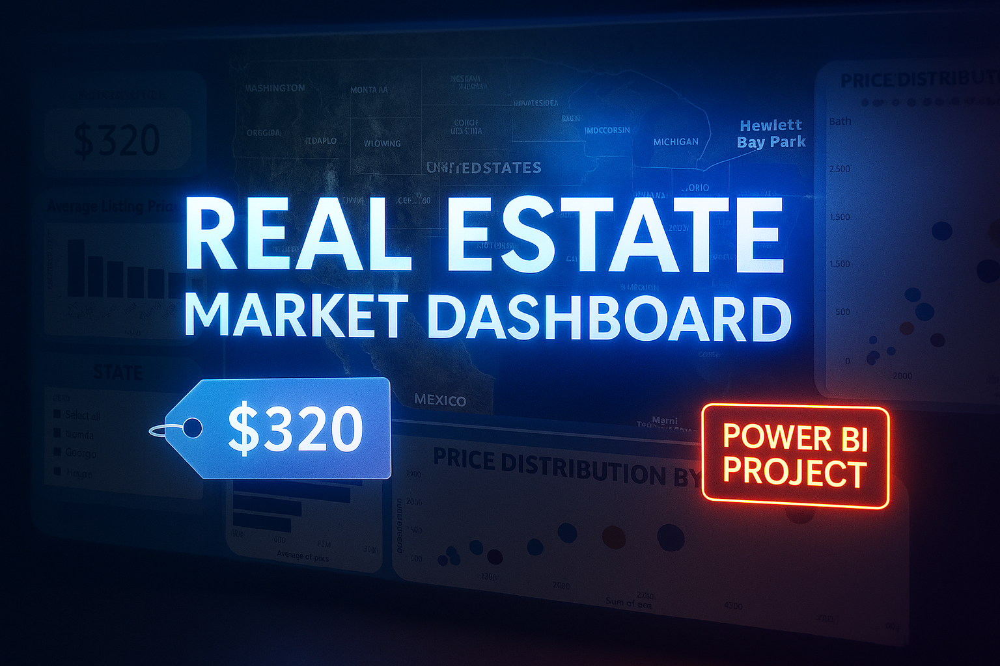

# 🏡 Real Estate Market Insights Dashboard

📊 **Interactive Dashboard | Data Analysis | Business Intelligence**  
🔍 **Explore pricing trends, property value patterns, and layout affordability from 10,000+ listings across the U.S.**

---

## 🔎 Business Problem

**How can real estate analysts identify high-value market patterns, pricing anomalies, and optimal layouts across different U.S. states?**

Real estate professionals, investors, and brokers need to make data-driven decisions when evaluating price per square foot, high-cost layouts, and location-specific trends. This project delivers insight into pricing disparities and layout structures that drive valuation.

---

## 📈 Dashboard Highlights

### 🔹 Page 1: Geographic & State-Level Insights
- **Avg Price** & **Price per Sq Ft** KPIs
- **Top City by Price**: Hewlett Bay Park
- **Price by State** (bar chart + filled map)
- **Interactive State Filter**

### 🔹 Page 2: Layout & Property Design Insights
- **Top Layout**: 10 bed / 11 bath @ $4216 per Sq Ft
- **Top 10 Most Expensive Bed/Bath Layouts**
- **Price Distribution by Layout** (scatter plot)
- **Bedroom Count Filter** (slicer)

---

## 🛠 Tools Used

- **Power BI Desktop** (Data Modeling & Dashboard Design)
- **Google Colab (Python)** – Data aggregation, top 10 city insights
- **Excel/CSV** – Data cleaning and preprocessing
- **GitHub** – Portfolio hosting

---

## ✅ Business Recommendation

CoStar and similar real estate platforms could enhance their lead scoring and valuation modeling by:
> **Incorporating layout-based pricing analysis** to target luxury homebuyers and **benchmarking price per sq ft by region** to guide broker strategies.

---

## 📂 Files in This Repo

| File | Description |
|------|-------------|
| `REAL_ESTATE.ipynb` | Python notebook used for EDA and top 10 city pricing |
| `final_real_estate_cleaned.csv` | Cleaned dataset for Power BI |
| `REAL ESTATE BI.pbix` | Power BI source dashboard |
| `Real_Estate_Market_Insights_Dashboard.pptx` | PowerPoint presentation version |
| `RETAIL_THUMBNAIL.png` | Custom project thumbnail |
| `DC_LOGO.png` | Personal branding |

---

## 🚀 Interactive Dashboard (Coming Soon)

🔗 *Want to view this live?* Stay tuned — I'm currently migrating it to [Power BI Service](https://app.powerbi.com) or an [interactive web app](#) (GitHub Pages or Streamlit).

---

## 💼 About Me

📌 Dionte Cape  
🔗 [LinkedIn](https://www.linkedin.com/in/dionte-capleton-54074524a/)  
🔗 [GitHub](https://github.com/Dionte18Cape)

---

